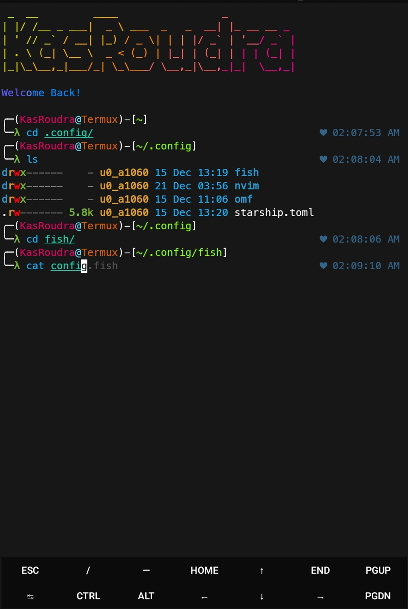

<h1 align="center">Oh-My-Shell</h1>

<p align="center">
  
<!--  
  
  -->
  
<br>
<br>
  
  
  
</p>


### [+] Description :

***Empower your terminal with the might of fish and oh-my-fish!***

### [+] Installation

#### Clone this repository

 - ```git clone https://github.com/KasRoudra/oh-my-shell```

#### Enter the directory
 - ```cd oh-my-shell```

#### Run the tool
 - ```./install.sh```


#### Or, Directly run

```
bash -c "$(curl -fsSL https://raw.githubusercontent.com/KasRoudra/oh-my-shell/main/install.sh)"

```

### Features:

 - Uses Friendly Interactive Shell (Fish)
 - Typing Auto-Suggestion and Syntax-Highlighting (from Fish)
 - Based on Oh-My-Fish FrameWork
 - Attractive built in theme 
 - Font to support emojies
 - Easy to use

### Requirements
 - `Fish`
 - `Git`
 - `Ruby or Python` (optional)
 - `Figlet`
 - ~60MB basic storage(400MB+, if you want rainbow colors)
 
If not found, all of the required packages will be installed on first run

#### Tested on

 - `Termux`
 - `Kali-Linux`


<h2 align="center">Before</h2>


<h2 align="center">After</h2>




## Credits: <a href="https://github.com/fish-shell/fish-shell">Fish-Shell</a> and <a href="https://github.com/oh-my-fish/oh-my-fish">Oh-My-Fish</a>

####  If this tool helped you, consider staring this repository. Your stars encourage me a lot!

## [~] Find Me on :
- [](https://github.com/KasRoudra)

- [](mailto:kasroudrakrd@gmail.com)
 
- [](https://facebook.com/KasRoudra)

- [](https://m.me/KasRoudra)